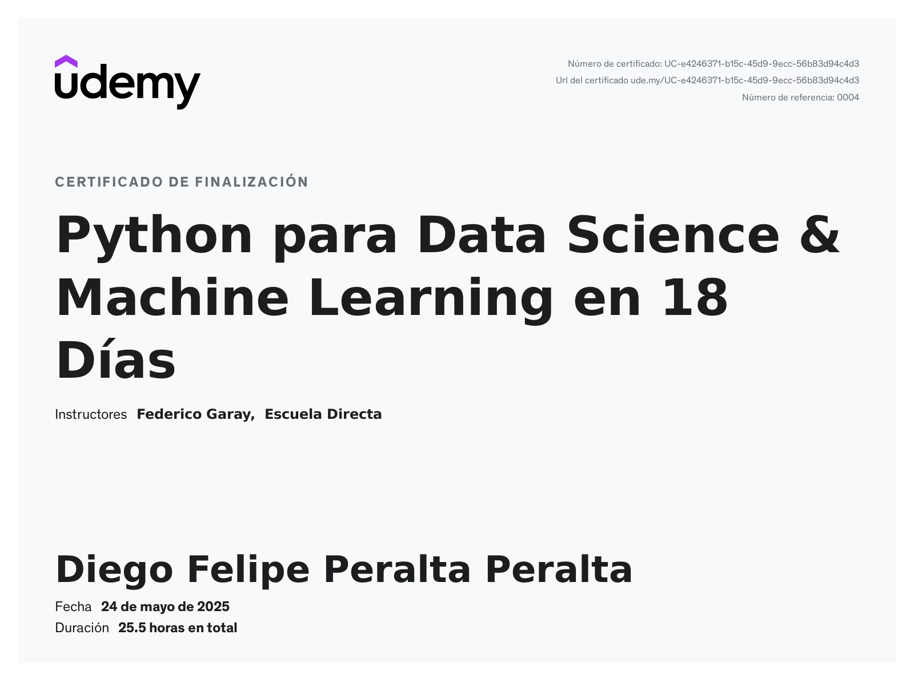

# Machine Learning & Data Science - Learning Journey

Este repositorio centraliza mi aprendizaje y práctica en Machine Learning y Data Science, incluyendo bootcamps completados, cursos en progreso y estudio de libros técnicos.

## Estructura del Repositorio

```
ML/
├── bootcamps/          # Bootcamps y cursos completados
├── books/              # Libros técnicos
└── README.md
```

## Bootcamps

### Python para Data Science - 18 Días ✅ COMPLETADO

**Plataforma:** Udemy
**Estado:** Completado con certificado

Curso intensivo que cubre desde fundamentos de Python hasta Machine Learning y visualización de datos.

**Temas principales:**
- Fundamentos de Python (variables, estructuras de control, funciones)
- Pandas y NumPy para análisis de datos
- Visualización con Matplotlib, Seaborn y Plotly
- Machine Learning (regresión, clustering, reinforcement learning)
- Scikit-Learn para modelos de ML
- PowerBI y APIs

**Certificado:**



### Machine Learning y Data Science 🚧 EN PROGRESO

## Libros

### Hands-on Machine Learning 🚧 EN PROGRESO

## Objetivo

Este repositorio documenta mi camino de aprendizaje en Machine Learning y Data Science, desde los fundamentos hasta técnicas avanzadas, combinando teoría, práctica y proyectos reales.

---

**Última actualización:** Febrero 2026
