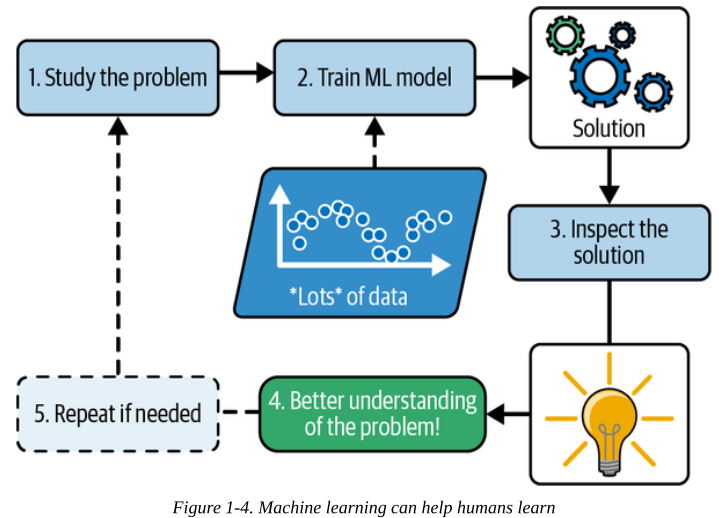

# The Machine Learning Landscape Part 1

- Machine learning is no longer science fiction: billions of people use it every day.
- The first ML application: back in the
1990s: the spam filter.

## What Is Machine Learning?

- Machine learning is the science (and art) of programming computers so they can learn from data.
- More general defintion:
  - Machine learning is the field of study that gives computers the ability to learn without being explicitly programmed. - Arthut Samuel, 1959.
- More engineering-oriented one:
  - A computer program is said to learn from experience E with respect to some task T and some performance measure P, if its performance on T, as measured by P, improves with experience E. —Tom Mitchell, 1997

## Initial Glossaty

- Trainning data: The examples that the system uses to learn. Is experience.
- Each training example is called a training instance (or sample).
- Model: The part of a machine learning system that learns and makes predictions. Ex: Neural networks, random forests.
- Performance: Accuracy

## Why Use Machine Learning?

- Ex: Spam filter

### Traditional approach

1. Study the problem
2. Write rules
3. Evaluate
4. Launch
5. Analyze errors

- 
- Since the problem is difficult, your program will likely become a long list of complex rules—pretty hard to maintain.

### Machine Learning

- A spam filter based on machine learning techniques automatically learns which words and phrases are good predictors of spam by detecting unusually frequent patterns of words in the spam examples. The program is much shorter, easier to maintain, and most likely more accurate.
- 
- A spam filter based on machine learning techniques automatically notices that “For U” has become unusually frequent in spam flagged by users, and it starts flagging them without your intervention.
- 

### Another area

- Another area where machine learning shines is for problems that either are too complex for traditional approaches or have no known algorithm.
- For example, consider speech recognition: The best solution (at least today) is to write an algorithm that learns by itself, given many example recordings for each word.

### Machine Learning to learn

- Machine learning can help humans learn (Figure 1-4). ML models can be inspected to see what they have learned (although for some models
this can be tricky).
- 

## Examples of Applications

- Analyzing images of products on a production line to automatically classify them (CNN, tranformers)
- Detecting tumors in brain scans (CNN, tranformers)
- Automatically classifying news articles (NLP, RNNs)
- Automatically flagging offensive comments on discussion forums, Summarizing long documents automatically (NLP)
- Creating a chatbot or a personal assistant (NLP, NLU)
- Forecasting your company’s revenue next year, based on many performance metrics (regression, regression support vector machine, random forest etc)
- Making your app react to voice commands, Recommending a product that a client may be interested in, based on past purchases and many more!
