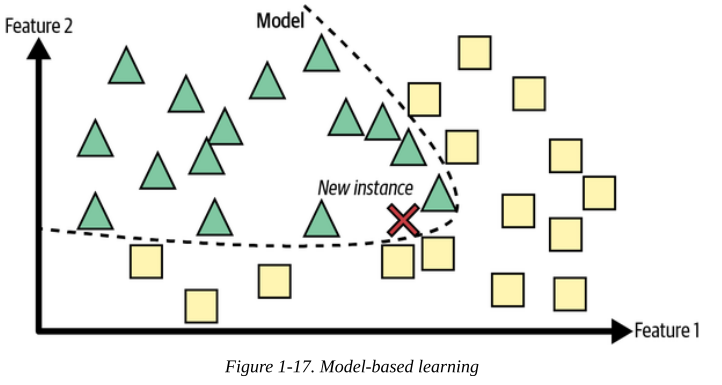
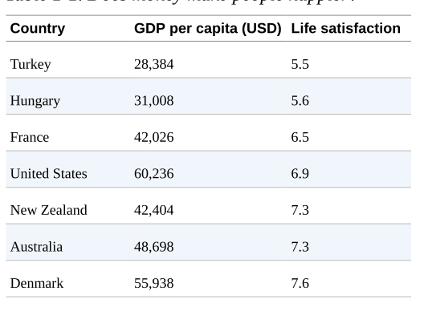
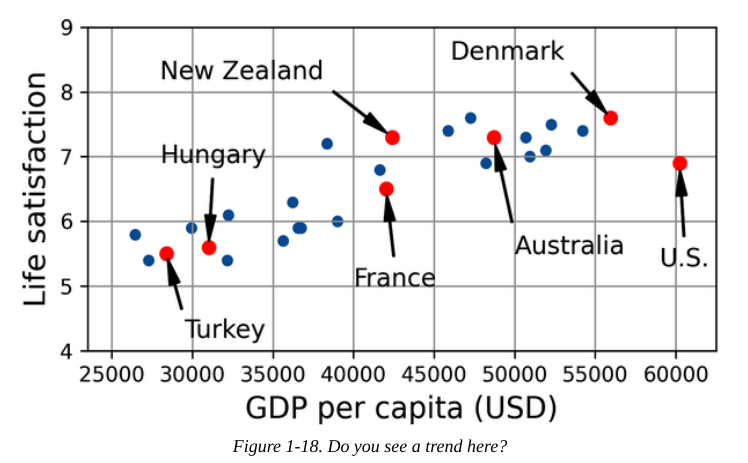

# The Machine Learning Landscape Part 2

## Types of Machine Learning Systems

- Is useful to classify them in broad categories, based on the following criteria:
  - How they are supervised during training (supervised, unsupervised, semi-supervised, self-supervised, and others)
  - Whether or not they can learn incrementally on the fly (online versus batch learning)
  - Whether they work by simply comparing new data points to known data points, or instead by detecting patterns in the training data and building a predictive model, much like scientists do (instance-base  versus model-based learning)

### Training Supervision

- ML systems can be classified according to the amount and type of supervision they get during training:

#### Supervised learning

- In supervised learning, the training set you feed to the algorithm includes the desired solutions, called labels
- 
- Ex:
  - Classification: The spam filter,  it is trained with many example emails along with their class (spam or ham).
  - Regression: Predict a target numeric value, such as the price of a car, given a set of features (mileage, age, brand, etc.). You need to give itmany examples of cars, including features and targets.

#### Unsupervised learning

- The training data is unlabeled. The system tries to learn without a teacher.
- Ex:
  - Say you have a lot of data about your blog’s visitors. You may want to run a clustering algorithm to try to detect groups of similar visitors. At no point do you tell the algorithm which group a visitor belongs to: it finds those connections without your help.
  - 
  - Visualization algorithms are also good examples of unsupervised learning: you feed them a lot of complex and unlabeled data, and they output a 2D or 3D representation of your data that can easily be plotted
    - 
  - A related task is dimensionality reduction, in which the goal is to simplify the data without losing too much information. One way to do this is to merge several correlated features into one.
  - Yet another important unsupervised task is anomaly detection—for example, detecting unusual credit card transactions to prevent fraud, catching manufacturing defects, or automatically removing outliers from a dataset before feeding it to another learning algorithm.
    - 
  - Association rule learning, in which the goal is to dig into large amounts of data and discover interesting relations between attributes.

#### Semi-supervised learning

- Some algorithms can deal with data that’s partially labeled.
- Some photo-hosting services, such as Google Photos, are good examples of this. Once you upload all your family photos to the service, it automatically recognizes that the same person A shows up in photos 1, 5, and 11, while another person B shows up in photos 2, 5, and 7.
- Most semi-supervised learning algorithms are combinations of
unsupervised and supervised algorithms. For example, a clustering algorithm may be used to group similar instances together, and then every unlabeled instance can be labeled with the most common label in its cluster.
- Ex:
  - Two classes (triangles and squares): the unlabeled examples (circles) help classify a new instance (the cross) into the triangle class rather than the square class, even though it is closer to the labeled squares
  - 

#### Self-supervised learning

- Generating a fully labeled dataset from a fully unlabeled one.Oonce the whole dataset is labeled, any supervised learning algorithm can be used.
- Ex:
  - If you have a large dataset of unlabeled images, you can randomly mask a small part of each image and then train a model to recover the original image (Figure 1-12). During training, the masked images areused as the inputs to the model, and the original images are used as the labels.
  - 
- Some people consider self-supervised learning to be a part of unsupervised learning, since it deals with fully unlabeled datasets. But self-supervised learning uses (generated) labels during training, so in that regard it’s closer to supervised learning.

#### Reinforcement learning

- The learning system, called an agent in this context, can observe the environment, select and perform actions, and get rewards in return (or penalties in the form of negative rewards).
- 
- Ex:
  - Many robots implement reinforcement learning algorithms to learn how to walk.

### Batch Versus Online Learning

- Another criterion used to classify machine learning systems is whether or not the system can learn incrementally from a stream of incoming data.

#### Batch learning

- The system is incapable of learning incrementally: it must be trained using all the available data.
- It is tipically done offline
- First the system is trained, and then it is launched into production and runs without learning anymore.
- A model’s performance tends to decay slowly over time, simply because the world continues to evolve while the model remains unchanged. The solution is to regularly retrain the model on up-to-date data.
- If you want a batch learning system to know about new data (such as a new type of spam), you need to train a new version of the system from scratch on the full dataset (not just the new data, but also the old data).
- This solution is simple and often works fine, but training using the full set of data can take many hours.
- Training on the full set of data requires a lot of computing resources (CPU, memory space, disk space, disk I/O, network I/O, etc.), costing a lot of money

#### Online Learning

- In online learning, you train the system incrementally by feeding it data instances sequentially, either individually or in small groups called mini-batches.
- Each learning step is fast and cheap, so the system can learn about new data on the fly, as it arrives
- 
- Online learning is useful for systems that need to adapt to change extremely rapidly.
- Online learning algorithms can be used to train models on huge datasets that cannot fit in one machine’s main memory (this is called out-of-core learning).
- 
- Learning rate: How fast they should adapt to changing data.
  - High learning rate: Your system will rapidly adapt to new data, but it will also tend to quickly forget the old data.
  - Low learning rate: The system will have more inertia; that is, it will learn more slowly, but it will also be less sensitive to noise in the new data or to sequences of nonrepresentative data points (outliers).
- A big challenge with online learning is that if bad data is fed to the system.
  - If it’s a live system, your clients will notice.
  - For example, bad data could come from a bug.
  - To reduce this risk:
    - Monitor your system closely and promptly switch learning off (and possibly revert to a previously working state).
    - Monitor the input data and react to abnormal data.

### Instance-Based Versus Model-Based Learning

- One more way to categorize machine learning systems is by how they generalize.
- Most machine learning tasks are about making predictions.
- Having a good performance measure on the training data is good, but insufficient; the true goal is to perform well on new instances.

#### Instance-based learning

- Possibly the most trivial form of learning is simply to learn by heart.
- Ex:
  - It would just flag all emails that are identical to emails that have already been flagged by users.
  - The system would flag an email as spam if it has many words in common with a known spam email.
- This is called instance-based learning: the system learns the examples by heart, then generalizes to new cases by using a similarity measure to compare them to the learned examples (or a subset of them).
- For example, the new instance would be classified as a triangle because the majority of the most similar instances belong to that class.
- 

#### Model-based learning and a typical machine learning workflow

- Another way to generalize from a set of examples is to build a model of these examples and then use that model to make predictions.
- 
- Ex:
  - Suppose you want to know if money makes people happy
  - 
  - 
    - Model selection: It looks like life satisfaction goes up more or less linearly as the country’s GDP per capita increases, so you decide to model life satisfaction as a linear function of GDP per capita.
  - 
    - This model has two model parameters, θ0 and θ1. By tweaking these parameters, you can make your model represent any linear function
    - How can you know which values will make your model perform best?
      - You can either define a utility function (or fitness function) that measures how good your model is.
      - Or you can define a cost function that measures how bad it is.
      - For linear regression problems, people typically use a cost function that measures the distance between the linear model’s predictions and the training examples; the objective is to minimize this distance.
    - You feed it your training examples, and it finds the parameters that make the linear model fit best to your data. This is called training the model. In our case, the algorithm finds that the optimal parameter values are θ0 = 3.75 and θ1 = 6.78 × 10–5.
    - 
    - You are finally ready to run the model to make predictions.
      - Ex: How happy Cypriots are?
        - You look up Cyprus’s GDP per capita, find $37,655, and then apply your model and find that life satisfaction is likely to be somewhere around 3.75 + 37,655 × 6.78 × 10–5 = 6.30.
  - Python code:

  ```python
  import matplotlib.pyplot as plt
  import numpy as np
  import pandas as pd
  from sklearn.linear_model import LinearRegression
  # Download and prepare the data
  data_root = "https://github.com/ageron/data/raw/main/"
  lifesat = pd.read_csv(data_root + "lifesat/lifesat.csv")
  X = lifesat[["GDP per capita (USD)"]].values
  y = lifesat[["Life satisfaction"]].values
  # Visualize the data
  lifesat.plot(kind='scatter', grid=True,
  x="GDP per capita (USD)", y="Life satisfaction")
  plt.axis([23_500, 62_500, 4, 9])
  plt.show()
  # Select a linear model
  model = LinearRegression()
  # Train the model
  model.fit(X, y)
  # Make a prediction for Cyprus
  X_new = [[37_655.2]] # Cyprus' GDP per capita in 2020
  print(model.predict(X_new)) # output: [[6.30165767]]
  ```

  - If all went well, your model will make good predictions. If not, you may need to use more attributes, get more or better-quality training data, or perhaps select a more powerful model.
  - Summary:
    - You studied the data.
    - You selected a model.
    - You trained it on the training data.
    - Finally, you applied the model to make predictions on new cases.
  