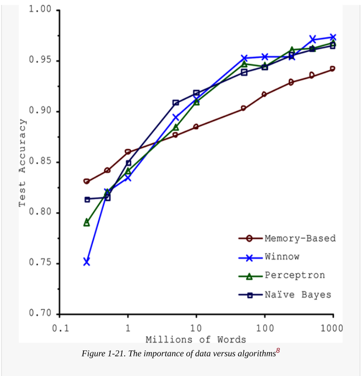
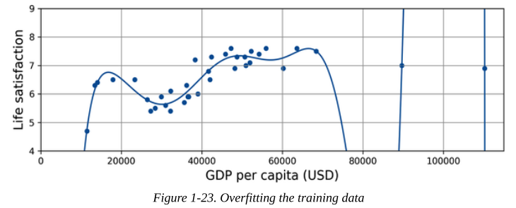

# The Machine Learning Landscape Part 3

## Main Challenges of Machine Learning

- Two things that can go wrong are: "bad model" and "bad data".

### Insufficient Quantity of Training Data

- It takes a lot of data for most machine learning algorithms to work properly.
- Even for very simple problems you typically need thousands of examples, and for complex problems such as image or speech recognition you may need millions ofexamples.
- But: Research showed that when enough data is available, even simple machine learning algorithms can perform similarly on complex tasks. This led to the idea that data can matter more than the algorithm itself. However, since large datasets aren’t always available, algorithm development still remains important.
- 

### Nonrepresentative Training Data

- To train a model properly, the data must represent the real-world cases where the model will be used. If the dataset is too small, it may contain errors or be distorted by chance. However, even a large dataset can be poor if it was collected in a biased or incorrect way. This is called sampling bias.
- It is not just about having a lot of data — the data must accurately reflect reality.
- Ex:
  - In the 1936 U.S. election, the Literary Digest predicted the wrong winner because they surveyed mostly wealthy people (10 million) and only a small percentage responded (2.4 million). This caused sampling bias and nonresponse bias.
  - In the YouTube example, collecting “funk music” videos through search results would only capture popular or region-biased content, not all funk videos. This also creates sampling bias.

### Poor-Quality Data

- It is often well worth the effort to spend time cleaning up your training data.
- Ex:
  - If some instances are clearly outliers, it may help to simply discard them or try to fix the errors manually.
  - If some instances are missing a few features (e.g., 5% of your customers did not specify their age), you must decide whether you want to ignore this attribute altogether, ignore these instances, fill in the missing values (e.g., with the median age), or train one model with the feature and one model without it.

### Irrelevant Features

- Your system will only be capable of learning if the training data contains enough relevant features and not too many irrelevant ones.
- Feature engineering: A critical part of a machine learning project that involves creating and selecting effective features to train the model. Involves the following steps:
  - Feature selection: selecting the most useful features to train on among existing features.
  - Feature extraction: combining existing features to produce a more useful one⁠—as we saw earlier.
  - Creating new features by gathering new data

### Overfitting the Training Data

- Overgeneralizing is something that we humans do all too often, and unfortunately machines can fall into the same trap.
- Overfitting: it means that the model performs well on the training data, but it does not generalize well.
- Example of overfittingthe training data
  - 
  - High-degree polynomial life satisfaction model that strongly overfits the training data.
- Complex models like deep neural networks can pick up very subtle patterns, but if the dataset is small or noisy, they may learn meaningless patterns that occurred by chance. These patterns will not generalize to new data.
- Regularization: Constraining a model to make it simpler and reduce the risk of overfitting.
  - By limiting how much the model’s parameters can change, it reduces the model’s flexibility. The goal is to find a balance: not too simple (underfitting) and not too complex (overfitting).
  - 
  - The regularized model (dashed line) fits the training data less perfectly than the first model, but it generalizes better to new, unseen points.
  - A regularization hyperparameter controls how much the model is simplified. If the value is too high, the model becomes too simple and may underfit.

### Underfitting the Training Data

- Underfitting is the opposite of overfitting: it occurs when your model is too simple to learn the underlying structure of the data.
- Options for fixing this problem:
  - Select a more powerful model.
  - Feed better features to the learning algorithm (feature engineering).
  - Reduce the constraints on the model

### Conclusion

- The system will not perform well if your training set is too small, or if the data is not representative, is noisy, or is polluted with irrelevant features (garbage in, garbage out). Lastly, your model needs to be neither too simple (in which case it will underfit) nor too complex (in which case it will overfit).
