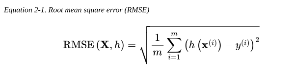
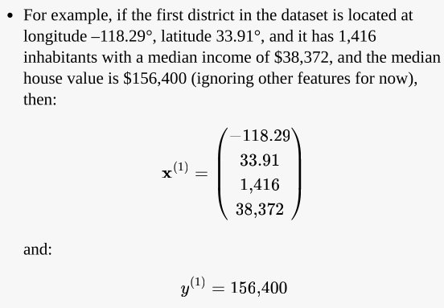
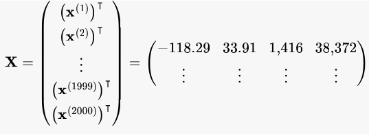
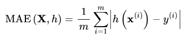

# End-to-End Machine Learning Project

## Look at the Big Picture

- 
- The model should learn from this data and be able to predict the median housing price in any district.

### Frame the problem

- The first question to ask your boss is what exactly the business objective is.
- How does the company expect to use and benefit from this model?
  - Ex: Your boss answers that your model’s output will be fed to another machine learning system. This downstream system will determine whether it is worth investing in a given area. Getting this right is critical, as it directly affects revenue.
- The next question to ask your boss is what the current solution looks like (if any).
  - Ex: Our boss answers that the district housing prices are currently estimated manually by experts (but only 30% predictions are right).
- 
  - **Pipeline**: Is a sequence of data processing components. In Machine Learning, they are essential because raw data almost always requires many transformations before it is useful.
- With all this information, you are now ready to start designing your system:
  - First, determine what kind of training supervision the model will need: is it a supervised, unsupervised, semi-supervised, self-supervised, or reinforcement learning task?
  - Is it a classification task, a regression task, or something else?
  - Should you use batch learning or online learning techniques?
  - For this example:
    - Supervised Learning: Because the model is trained using data that already contains the correct answer (labels).
    - Regression: Because the ultimate goal is to predict a specific numerical value.
    - Multiple Regression: Because several features are used to calculate the prediction.
    - Univariate Regression: Because, despite using many inputs, only a single output value is predicted for each case.
    - Batch Learning: Because there is no continuous, real-time data flow; the system can be trained only once with the entire available dataset.

### Select a performance Measure

- A typical performance measure for regression problems is the root mean square error (RMSE).
  - 
  - Notations:
    - m is the number of instances in the dataset
    - x(i) is a vector of all the feature values (excluding the label) of the ith instance in the dataset, and y(i) is its labe.
      - 
    - X is a matrix containing all the feature values (excluding labels) of all instances in the dataset.
      - 
    - h is your system’s prediction function, also called a hypothesis.
    - RMSE(X,h) is the cost function measured on the set of examples using your hypothesis h.

- In some context, you may prefer to use another function:
  - If there are many outlier districts. In that case, you may consider using the mean absolute error (MAE)
    - 

- Both the RMSE and the MAE are ways to measure the distance between two vectors: the vector of predictions and the vector of target values.

### Check the assumptions

- The Risk: You could spend months perfecting a regression model (predicting exact prices), only to discover that the next system converts those prices into simple categories ("cheap," "expensive"). If that were the case, your problem should have been one of classification from the start, not regression.
- The Lesson: Confirming exactly what the downstream system needs ensures you're addressing the right problem before investing time in development.
