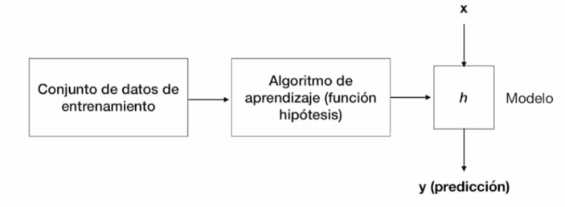

# Aprendizaje Supervisado

- El aprendizaje supervisado es la tarea de aprendizaje automático que consiste en aprender una función que mapea una entrada a una salida basada en pares de entrada-salida de ejemplo.
- La función resultante es utilizada posteriormente para predecir valores a partir de ejemplos de datos no etiquetados.
- Van a recibir un conjunto de datos etiquetados y el algoritmo aprenderá de ellos para asignar una etiqueta a nuevos ejemplos.

## Tipos de aprendizaje supervisado

### Regresión

- Intenta predecir valores continuos. Es decir, valor que se va a encontrar en un rango muy amplio de valores. 
- Ej: Coste de una casa.
- Encontrar la función hipótesis o modelo a parti de una tabla de valores.

### Clasificación

- Intenta predecir dos tipos principales de aprendizaje supervisado.
- Ej: Correo electrónico es SPAM o no SPAM.