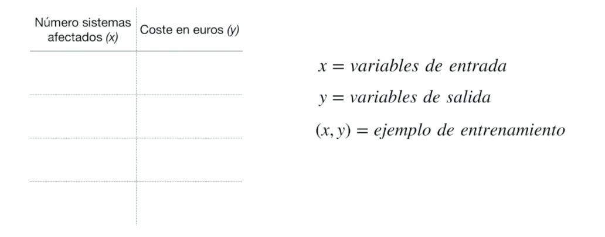
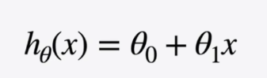
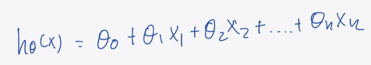
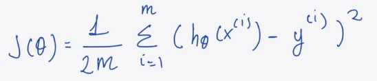
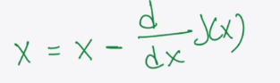
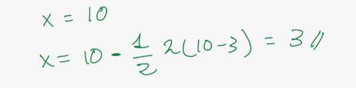
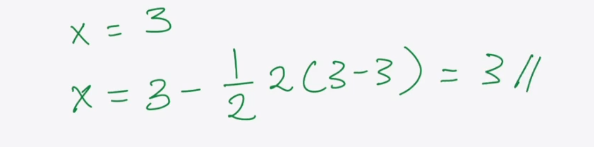
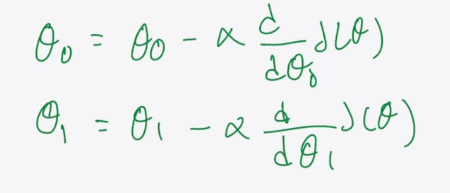

# **Regresión Lineal**

* Es un **algoritmo de aprendizaje supervisado**.
* Pertenece al grupo de **modelos basados en funciones matemáticas**.
* Se corresponde con un **modelo lineal**.
* Realiza predicciones computando una **suma ponderada de las características de entrada**, más una constante conocida como **bias** o **intercepto**.
* Se utiliza para **predecir valores continuos** (regresión, no clasificación).

> 

---

## **Función Hipótesis**

* El objetivo es encontrar una **función hipótesis** `hθ(x)` que represente la relación entre las variables de entrada y salida.

  **Esquema:**
  Conjunto de datos → Función hipótesis → Modelo → Predicciones

> 

* En regresión lineal simple:

  $$
  h_θ(x) = θ_0 + θ_1 x
  $$

  * `θ₀`: Intercepto (corte con el eje Y)
  * `θ₁`: Pendiente (inclinación de la recta)

---

### **Regresión Lineal Multivariable**

* Cuando se tienen múltiples características de entrada (`x₁, x₂, ..., xₙ`), se extiende a una **regresión lineal multivariable**:

> 

* La función hipótesis se generaliza a:

  $$
  h_θ(x) = θ_0 + θ_1 x_1 + θ_2 x_2 + ... + θ_n x_n
  $$

  o en forma vectorial:

  $$
  h_θ(x) = θ^T x
  $$

---

## **Construcción del Modelo**

* El objetivo es encontrar los **valores óptimos de los parámetros `θ`** (theta) que mejor ajusten los datos.
* Para ello, se **minimiza una función de coste**, que mide el error entre las predicciones del modelo y los valores reales.

### **Pasos del entrenamiento:**

1. Inicializar aleatoriamente los parámetros `θ₀, θ₁, ..., θₙ`.
2. Calcular el error utilizando una función de coste.
3. Aplicar un **algoritmo de optimización** para ajustar los parámetros y minimizar el error.
4. Repetir hasta que el error se reduzca lo suficiente o los parámetros dejen de variar significativamente.

---

## **Función de Coste**

* La función de coste más común en regresión lineal es el **Error Cuadrático Medio (MSE)**:

> 

$$
J(θ) = \frac{1}{2m} \sum_{i=1}^{m} (h_θ(x^{(i)}) - y^{(i)})^2
$$

Donde:

* `m`: número de ejemplos
* `hθ(x⁽ⁱ⁾)`: valor predicho por el modelo
* `y⁽ⁱ⁾`: valor real del conjunto de entrenamiento

---

## **Función de Optimización**

* Para minimizar la función de coste se utiliza frecuentemente el algoritmo de **Gradiente Descendente**.
* Este algoritmo actualiza los parámetros `θ` en la dirección de la mayor disminución del error, usando derivadas.

### **Gradiente Descendente Básico:**

$$
θ_j := θ_j - α \frac{∂J(θ)}{∂θ_j}
$$

* `α`: learning rate (tasa de aprendizaje)
* `∂J(θ)/∂θ_j`: derivada parcial de la función de coste con respecto a `θ_j`

> 

* Cada iteración ajusta `θ` en la dirección de la pendiente negativa del error.
* El proceso se repite hasta que el cambio en los parámetros sea mínimo (convergencia).

> Ejemplos del proceso:
> 
> 

### **Resumen del Proceso:**

* Inicialización de `θ`
* Repetir:

  * Calcular predicciones `hθ(x)`
  * Calcular el coste `J(θ)`
  * Actualizar los parámetros con gradiente descendente
* Hasta que `θ` converja.

> 

