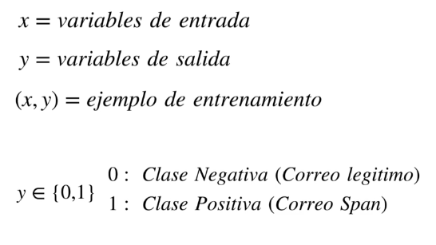
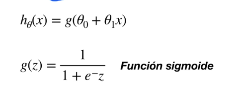
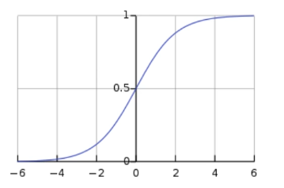
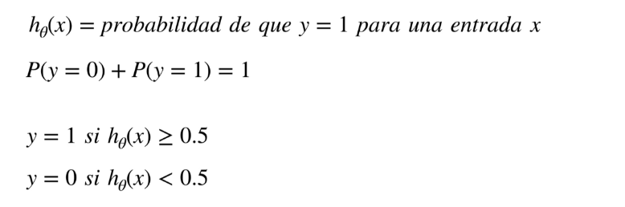
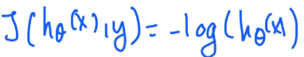
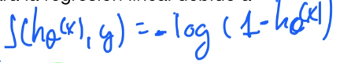
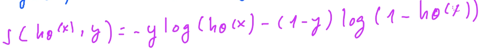
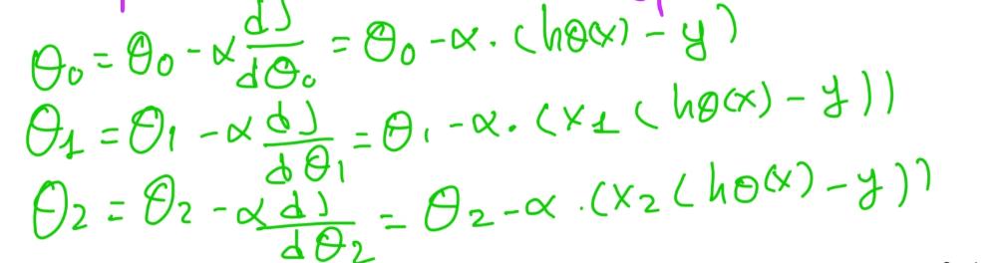

# **Regresión Logística**

* Algoritmo de **aprendizaje supervisado** → trabaja con datos etiquetados.
* **Modelo basado en funciones**, al igual que la regresión lineal.
* Es un **modelo lineal generalizado**.
* Realiza predicciones computando una **suma ponderada de características de entrada** más un **bias**, pero **aplica una función logística** (sigmoide) al resultado.
* Se utiliza para predecir **valores discretos** (ej. clasificación binaria).

### Objetivo:

* Clasificar ejemplos en dos clases:

  * `0`: Clase negativa.
  * `1`: Clase positiva.

### Función hipótesis:

* Función que predice la **probabilidad de pertenencia a la clase positiva**.

> 

* Elementos:

  * `X`: Características de entrada.
  * `y`: Etiquetas reales.
  * `(x, y)`: Pares de entrenamiento.
  * `y ∈ {0, 1}` → Problemas de **clasificación binaria**.
  * También puede extenderse a **clasificación multiclase** con técnicas como *one-vs-rest*.

---

## **Función Hipótesis**

La regresión logística **combina** la salida de un modelo lineal con una **función de activación no lineal**:

### 1. **Salida de la regresión lineal:**

$$
z = θ^T x = θ_0 + θ_1 x_1 + θ_2 x_2 + \dots + θ_n x_n
$$

### 2. **Función sigmoide:**

$$
h_θ(x) = \frac{1}{1 + e^{-z}}
$$

> 

* Esta es la **función hipótesis final**.
* El valor de `hθ(x)` estará **entre 0 y 1**, lo que se interpreta como una **probabilidad**.

> 

---

### **Interpretación del Resultado**

> 

* `hθ(x)` es la **probabilidad de que `y = 1` dado `x`**.
* `P(y = 1 | x; θ) = hθ(x)`
* `P(y = 0 | x; θ) = 1 - hθ(x)`

### **Umbral (threshold):**

* Se utiliza un **umbral de decisión**, generalmente **0.5**:

  * Si `hθ(x) ≥ 0.5` → se predice `y = 1`
  * Si `hθ(x) < 0.5` → se predice `y = 0`

---

## **Función de Coste**

* No se puede usar el **MSE** como en regresión lineal, ya que produce funciones no convexas (con óptimos locales).
* En su lugar, se usa una función de coste derivada del **log loss** o **entropía cruzada**.

### Coste individual:

* Si `y = 1`:

  $$
  \text{Cost} = -\log(h_θ(x))
  $$

  > 

* Si `y = 0`:

  $$
  \text{Cost} = -\log(1 - h_θ(x))
  $$

  > 

### Función de coste general (combinada):

> 

$$
J(θ) = \frac{1}{m} \sum_{i=1}^{m} \left[ -y^{(i)} \log(h_θ(x^{(i)})) - (1 - y^{(i)}) \log(1 - h_θ(x^{(i)})) \right]
$$

* Esta función **penaliza más fuertemente** cuando la predicción se aleja del valor real.
* Es **convexa**, lo que facilita encontrar el **mínimo global**.

---

## **Función de Optimización**

* Se usa **gradiente descendente** para minimizar la función de coste.

> 

* El gradiente de la función de coste respecto a los parámetros `θ` es:

$$
\frac{∂J(θ)}{∂θ_j} = \frac{1}{m} \sum_{i=1}^{m} (h_θ(x^{(i)}) - y^{(i)}) x_j^{(i)}
$$

* Este gradiente es **muy similar al de la regresión lineal**, pero con `hθ(x)` definido como la **sigmoide**.

---

## **Resumen del Proceso**

1. Inicializar los parámetros `θ` (pueden ser ceros o valores aleatorios pequeños).
2. Calcular `z = θ^T x` y aplicar la **función sigmoide**.
3. Calcular la **función de coste** con la fórmula de entropía cruzada.
4. Calcular el **gradiente** y actualizar los valores de `θ` usando gradiente descendente.
5. Repetir los pasos 2-4 hasta que la función de coste converja (o hasta cierto número de iteraciones).
6. Aplicar un **umbral** para tomar decisiones de clasificación.
