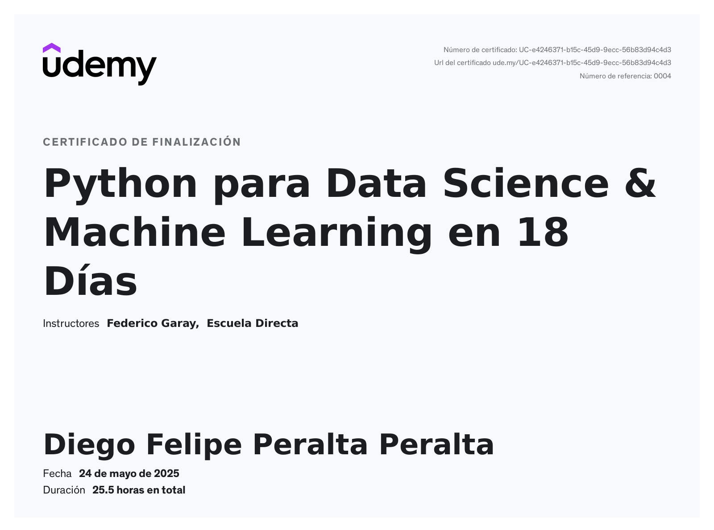

# Python para Data Science - Curso de Udemy

Este repositorio contiene el código y los materiales del curso "Python para Data Science" de Udemy.

## Temas Cubiertos

* Día 2: Variables numéricas y de texto, función type, números, operaciones.
* Día 3: Strings, filtrado de strings, formateo de strings, indexar strings, input.
* Día 4: Booleanos, estructuras de control (if, elif, else), listas, tuplas, diccionarios.
* Día 5: Loops (for, while), función range(), funciones.
* Día 6: Pandas - Parte 1: Series, DataFrames, operaciones básicas, limpieza de datos, filtrado, agregación.
* Día 7: Pandas - Parte 2: Ordenar, agrupar, fusionar, concatenar DataFrames, manejo de fechas, lectura/escritura de archivos.
* Día 8: NumPy: Arrays, tipos de arrays, manipulación, indexación, segmentación, forma y estructura, operaciones avanzadas, funciones universales, tratamiento de datos faltantes, importación/exportación de datos.
* Día 9: Matplotlib: Visualización de datos, estructura de Matplotlib, gráficos de línea, histogramas, gráficos scatter, gráficos de pastel, múltiples gráficos, estilos.
* Día 10: Seaborn: Introducción a Seaborn, relación estadística, representación distributiva, variables categóricas, vista múltiple, funciones de nivel inferior, valores preconfigurados y personalizados.
* Día 11: Machine Learning - Parte 1: Regresión lineal, regresión logística, árboles de decisión, bosques aleatorios.
* Día 12: Machine Learning - Parte 2: K-Means clustering, Principal Component Analysis (PCA), Singular Value Decomposition (SVD), autoencoders, clustering jerárquico.
* Día 13: Machine Learning - Parte 3: Q-Learning, SARSA, Redes Q Profundas (DQN).
* Día 14: Ética y Privacidad: Anonimización de datos, pseudonimización de datos, balanceo de datos.
* Día 15: Scikit-Learn: Introducción a Scikit-Learn, preprocesamiento de datos, selección y división de datos, pipelines, evaluación de modelos, ajuste de hiperparámetros.
* Día 16: PowerBI: Introducción a PowerBI.
* Día 17: Plotly: Estructura de un gráfico en Plotly, gráficos básicos, personalización, subplots, facetas, mapas, gráficos 3D, Dashboards con Plotly Dash, Cufflinks.
* Día 18: APIs: Uso de APIs, manejo de respuestas JSON, manejo de errores, códigos de estado HTTP, recolección de datos usando APIs.

## Certificado

