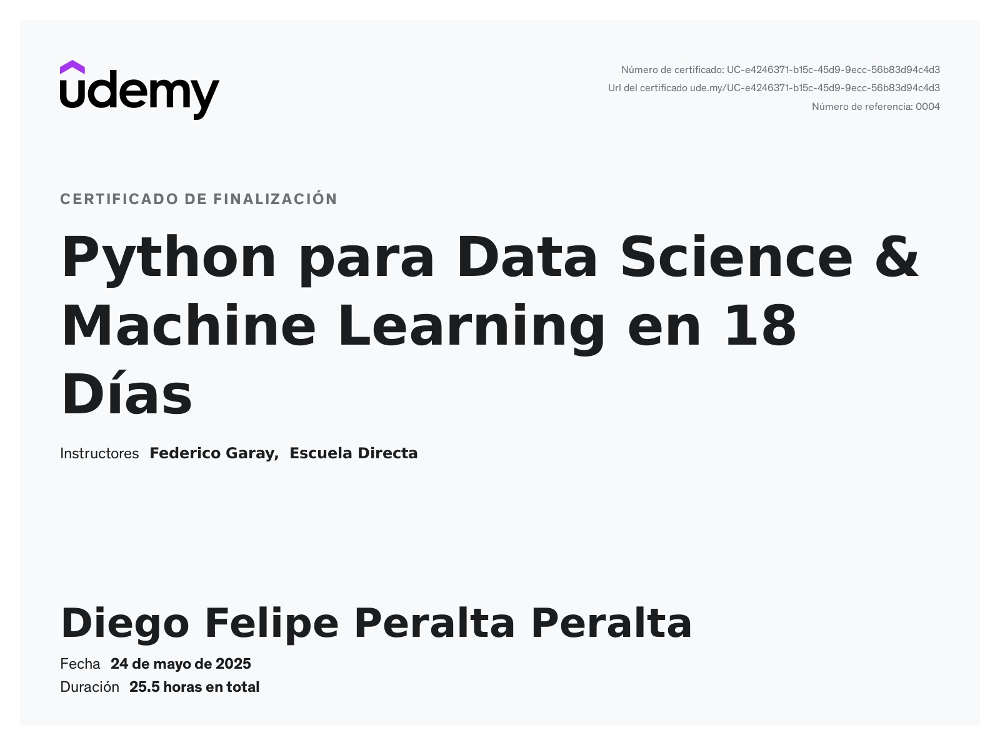

# Python para Data Science — Curso de Udemy

**Estado:** Completado

Este repositorio contiene el código y los materiales del curso **"Python para Data Science"** de Udemy. Recorre desde los fundamentos del lenguaje hasta Machine Learning, visualización avanzada y consumo de APIs, a lo largo de 18 días (los materiales comienzan en el Día 2).

## Estructura

| Carpeta | Contenido |
| --- | --- |
| `dia02` | Variables numéricas y de texto, `type`, números y operaciones. |
| `dia03` | Strings, filtrado, formateo, indexado e `input`. |
| `dia04` | Booleanos, estructuras de control (`if`/`elif`/`else`), listas, tuplas y diccionarios. |
| `dia05` | Loops (`for`, `while`), `range()` y funciones. |
| `dia06_Pandas1` | Pandas I: Series, DataFrames, limpieza, filtrado y agregación. |
| `dia07_Pandas2` | Pandas II: ordenar, agrupar, fusionar, concatenar, fechas y E/S de archivos. |
| `dia08_Numpy` | NumPy: arrays, indexación, ufuncs, datos faltantes y E/S. |
| `dia09_Matplotlib` | Matplotlib: líneas, histogramas, scatter, pie, múltiples gráficos y estilos. |
| `dia10_Seaborn` | Seaborn: relaciones estadísticas, distribuciones, categóricas y niveles figura/axes. |
| `dia11_ML1` | ML I: regresión lineal y logística, árboles de decisión y bosques aleatorios. |
| `dia12_ML2` | ML II: K-Means, PCA, SVD, autoencoders y clustering jerárquico. |
| `dia13_ML3` | ML III: Q-Learning, SARSA y Deep Q-Networks (DQN). |
| `dia14_EticaPrivacidad` | Ética y privacidad: anonimización, pseudonimización y balanceo de datos. |
| `dia15_ScikitLearn` | Scikit-Learn: preprocesamiento, split, pipelines, evaluación y tuning. |
| `dia16_PowerBI` | Power BI: introducción (material de referencia; sin notebooks). |
| `dia17_Plotly` | Plotly: gráficos básicos, personalización, subplots, mapas, 3D y Dash. |
| `dia18_APIS` | APIs: uso, JSON, errores, códigos HTTP y recolección de datos real. |
| `certificado` | Certificado de finalización del curso. |

Cada día incluye notebooks y, en varios casos, un `proyecto.ipynb` con el reto práctico correspondiente.

## Librerías utilizadas

`numpy`, `pandas`, `matplotlib`, `seaborn`, `scikit-learn`, `plotly`, `dash`, `cufflinks`, `keras`/`tensorflow` y `requests`.

> No hay entorno virtual versionado en esta carpeta. Los notebooks se ejecutaron con el kernel `dsml` (Python 3.11) disponible en local.

## Certificado

